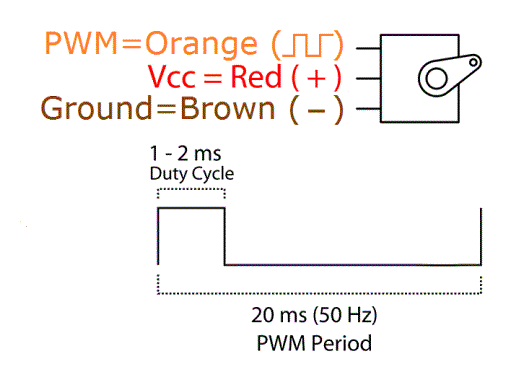
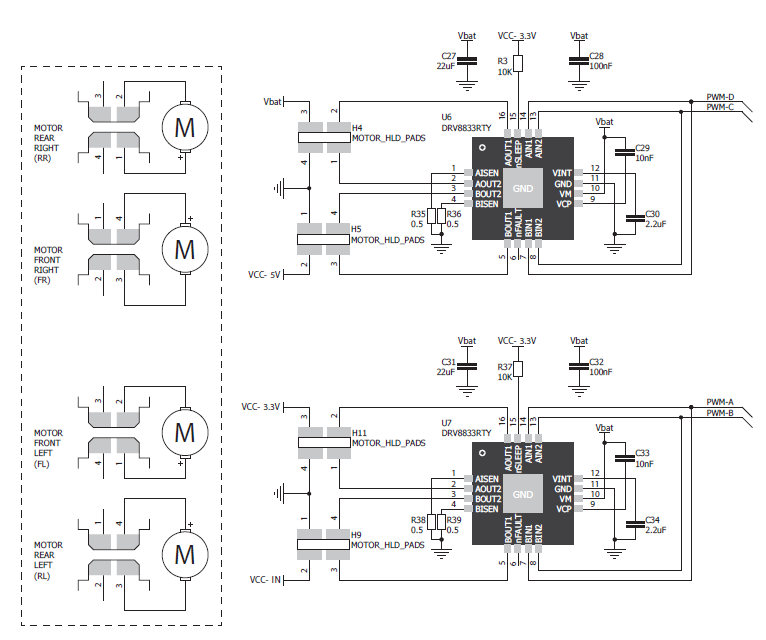
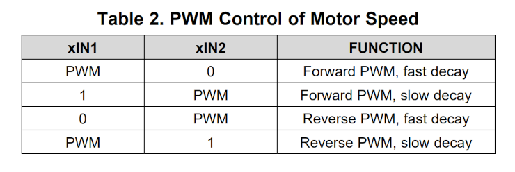

#  Lab 6 - Motors and PWM

## Learning outcomes

This lab session introduces the pulse width modulation (PWM) signal generation and the control of DC motors and RC servo motors. The lab covers the following aspects:

- Electrical connections to an RC servo motor.
- Generating a PWM signal with a timer 
- Controlling the RC servo motor angle using the LDR.
- Driving DC motors using an H bridge.
- Setting up CCP modules to generate PWM signals.
- Routines for speed control, turning, stopping, etc.

##	RC servo motor

RC servo motors are simple and cheap devices that enable you to actuate mechanical systems by setting the angular position of the motor output shaft. The output shaft is directly connected to a potentiometer which is monitored by an electronic circuit inside the motor to provide a closed loop control system. The angular position of the output shaft can be set by sending the motor a pulse width modulated (PWM) signal that encodes the desired angle. A typical pulse width of approx. 1ms to 2 ms is sent every 20 ms. The standard for RC servo PWM signals is fairly loose but a pulse width of 1.5 ms is usually the centre of the servo’s rotation. Most servos will rotate at least 90° and many can rotate further if driven with signals outside the 1-2ms range. The maximum range for the RC servo in this lab is approx. 180°.

###	Electrical connections to the RC servo motor

The following diagram shows the pin out from the RC servo motor. The colour coding for the servo is as follows: Brown (1) is ground, Red (2) is +3.3V, and Orange (3) is the PWM input signal (3.3V level). It is best to use a 3 pin header to allow easy connection/disconnection of the servo. In the first exercise you can generate the PWM signal on any output pin so the choice is up to you.

### Using a timer to control the RC servo motor

There are lots of methods of generating a PWM signal using the PIC chip. We are first going to use our knowledge of timers and interrupts to generate a signal that can be output to any general purpose output pin. We will learn to use a dedicated module to control DC motors in the second part of the (it can't run slow enough to control the RC servo).

To use timers and interrupts to generate a PWM signal the general method is to set the timer up to generate an interrupt (i.e. overflow) after the desired on time has passed. In the interrupt service route (ISR) the output pin is turned off and the timer is initialised again so that an interrupt is generated after the signal off time has passed. When this interrupt occurs the ISR sets output pin on and the process repeats. This procedure has been programmed in the rc_servo.c/h files in the GitHub repo, all that is left to do is to work out how fast we want to run the timer and the timer ticks that give the correct output signal lengths. 

For control of the RC servo motor a pulse needs to be sent every 20 ms and the on time (pulse width) can vary between approximately 0.5 ms and 2.1 ms. These on times give an approximate angular range of 180° on the RC servo output shaft, i.e. the output shaft will move to -90 degrees for a input pulse of 0.5 ms, and +90 degrees for a pulse of 2.1 ms in length. The relationship of pulse length between these values and output shaft angle is approximately linear. The smallest change in angle that the servo can produce is approximately 1 degree. If we want to be able control the servo at this angular resolution we need to make sure our timer is set up so that it can control the pulse length with the corresponding precision. This means calculating what change in pulse length corresponds to a 1 degree change in angle from the above information, and then configuring the timer prescaler so that one tick of the timer is smaller than this value. Once this is known it is simply a matter of calculating the corresponding timer values to generate the desired on/off times.

In the rc_servo.c/h files code is set up to operate Timer0 in 16bit mode and handle initialising the TMR0H/L registers with on time/off time in the ISR.

## Exercise 1. RC servo motor control

1.	Clone the GitHub repo and create a project adding the rc_servo.c/h and main.c files. 
1. 	Calculate what change in pulse length is required to change the output angle by 1 degree. Select a suitable prescaler for the timer based on this.
1.  Calculate what the total timer count would be for a 20 ms period, enter this value for T_PERIOD in rc_servo.h
1.  Complete the angle2PWM function to set the on_period and off_period values in timer counts.
1.	Code the main while loop so that the angle oscillates between -90° to 90° in 1° increments. Use a short software delay to make it move at approximately 20° per second.

## Exercise 2. Automatic window opener

The servo motor and LDR can be used to make a simple automatic window opener based on light level. During the day the window will be open and during the night it will be closed.

1.	Using the light meter code from previous labs, use the LDR readings to drive the RC servo motor. Set the servo motor to 90° (window fully open) at ambient room light level and -90° (window fully closed) when the LDR is covered.

## PWM and DC motor control

In this section of the lab we use hardware modules to generate PWM signals from the PIC chip to control the speed and direction of the DC motors on our buggy. 

### Buggy hardware
The buggy contains 4 DC motors and two DRV8833RTY dual H-bridge motor drivers. H-bridge motors drivers are needed as the PIC cannot supply enough current directly. The wiring diagram for the buggy motors is shown below. 

The left motors are controlled by the pins labelled PWM-A and B on the buggy (RE2 and RE4 on the clicker 2), whilst the right motors are controlled by PWM-C and D(RC7 and RG6 on the clicker 2). These inputs feed into separate motor drivers for the left and right motors. The PMW signals feed into both sets of inputs on the motor driver so that both motors on that side are driven with the same signal (it is not possible to independently control all 4 motors). One signal drives the voltage on one side of the motor, and the other drives the voltage on the other side of the motor. When there is a difference in voltage level between the sides current flows and motors turn. 

###	Controlling DC motors using PWM

There are various schemes for driving motors through an H-bridge with PWM pulses. The general scheme we will use here is keep one side of the motor at a constant voltage and feed the PWM signal to the other side of the motor. The motor direction is contolled by swapping the constant voltage side for the PWM side. Motor speed/power is controlled by varying the PWM duty cycle. Typical PWM frequencies for driving DC motors range from 5 kHz to 20 kHz.

### Breaking and coasting (slow and fast decay)

When controlling a DC motor with PWM the inductive nature of the motor windings requires that current must continue to flow even when the externally applied drive current is removed. This is called recirculation current and can be handled in two different ways by the H-bridge circuit. In fast decay mode the inductive current in the motor windings is quickly dissipated, allowing the motor to turn relatively freely or "coast". In slow decay mode inductive current is kept in the motor windings by shorting the motor terminals, providing a path to quickly dissipate the motor's stored energy creating a braking effect.

The DRV8833RTY controller allows us to switch between slow and fast decay as detailed in the table below. Remember fast decay makes the motor coast and slow decay makes the motor brake when the drive current is removed.

In fast decay mode one side of the motor is constantly low and the motor power/speed is defined by the on time of the duty cycle. So at 75% duty cycle the motor power/speed is 75% of what would be supplied if a constant voltage was applied. In slow decay mode one side of the motor is constantly high and the power/speed is defined by the off time in the PWM cycle. This means to drive the motor at 75% power/speed the duty cycle needs to 25%. It is important not to suddenly change the power to the motors as this will cause a spike in current draw and potentially back EMF onto the Clicker 2 board which can cause stability problems. Gradual changes should be used to reduce this problem.

### Generating a PWM signal using the CCP module

The CCP (capture, compare, PWM) module is a multi function module capable of automatically generating a PWM signal on dedicated pins and uses a timer module to help with this. We will be using four CCP modules to generate the PWM signals, two for the left hand motors and two for the right hand motors. This approach allows full control of the motors including diretion, speed/power and decay mode. The CCP module outputs can be mapped to the correct pins on the buggy using the PPS feature. Timer2 is used to generate the timebase for the PWM signal. Timer2 contains a period register to reset the timer. When the value stored in the period register is reached the Timer2 value resets to zero and any enabled PWM outputs are set high. The timer continues to increment and eventually matches a value store in one of the CCP duty cycle registers (CCPRxH). When this occurs the output for the corresponding pin is set low. The timer continues to increment and matches with other CCP duty cycle register, causing the pins associated with those registers to be set low as well. The timer eventually reaches the period register value, resets and the process starts again.

Before setting up the CCP module Timer2 needs to be configured first. As suitable base frequency needs to be chosen (say 10kHz) and Timer2 prescaler configured to enable that frequency to be produced with the 8 bit timer (the maximum period possible is 255). The period register T2PR can then be written to set the exact period (to give 10kHz). The timer is then turned on using the appropriate bit in the T2CON register.

    // Timer 2 config
    T2CONbits.CKPS=???; // set prescaler here
    T2HLTbits.MODE=0b00000; // Free Running Mode, software gate only
    T2CLKCONbits.CS=0b0001; // Fosc/4

    // Tpwm*(Fosc/4)/prescaler - 1 = PTPER
	
    T2PR=???; //Period reg, calculate value for 10kHz base period
    T2CONbits.ON=1; //Turn the timer on
	
Now that the timer has been set up we need to configure the CCP modules.	To set the duty cycle we write a value to the CCPRxH register. This value can be any value between 0 and the value written to T2PR. A 0 value gives 0% duty cycle, and a value equal to (or greater than) T2PR  will give a 100% duty cycle. For example, for CCP1:
   
    CCPR1H=0; //0% duty
	CCPR1H=T2PR; //100% duty
	
The CCP modules then need to be configured using the CCPxCON registers. For CCP1:
      
    CCP1CONbits.CCP1MODE=0b1100; // set module to PWM mode  
	CCP1CONbits.FMT=1; // left align the duty cycle register (so we can just use high byte only)
    CCP1CONbits.EN=1; // enable the PWM output
	
We also need to tell the CCP module which timer to use. This is done with the CCPTMRS0 register for CCP modules 1-4. To set CCP1 to use Timer2 for PWM generation we set the corresponding bits to zero:

	CCPTMRS0bits.C1TSEL=0; //use Timer2 for PWM

See section 22 of the datasheet for a full description of these registers and configuration bits.
	
The final step is to map the CPP module's output to the appropriate pin by configuring the pin's PPS register. To map CCP1 to pin RE2 (PWM-A on the buggy), we would write the following:
	
	RE2PPS=0x05; // CCP1 output is connected to pin RE2 

Settings to map the outputs from CCP2-4 to the other pins (RE4, RC7, RG6) are given in section 17 of the datasheet (Table 17-2). Note TRIS registers also need to be configured for output.

###	Using structures
When a group of variables share a common element it may be useful to group them together into a structure. In this lab we have a number of parameters that are associated with each motor, for example: speed, direction, PWM channels, etc. Creating a structure to hold these variables makes passing them between functions very simple. For example, we might define a structure called motor as follows:

	struct DC_motor { //definition of DC_motor structure
		unsigned char power;         //motor power, out of 100
		unsigned char direction;     //motor direction, forward(1), reverse(0)
		unsigned char brakemode;	//slow or fast decay (braking or coasting)
		unsigned int PWMperiod; //base period of PWM cycle
		unsigned char *posDutyHighByte; //PWM duty address for motor +ve side
		unsigned char *negDutyHighByte; //PWM duty address for motor -ve side
	};

Each element of the structure can be accessed with the . operator. We then declare the structure an give it some initial values:

	struct DC_motor motorL, motorR; 		//declare two DC_motor structures 

    motorL.power=0; 						//zero power to start
    motorL.direction=1; 					//set default motor direction
    motorL.brakemode=1;						// brake mode (slow decay)
    motorL.posDutyHighByte=(unsigned char *)(&CCPR1H);  //store address of CCP1 duty high byte
    motorL.negDutyHighByte=(unsigned char *)(&CCPR2H);  //store address of CCP2 duty high byte
    motorL.PWMperiod=PWMcycle; 			//store PWMperiod for motor (value of T2PR in this case)

	//same for motorR but different CCP registers

Note setting the values in the structure does not change the values in the CCP registers. To do that we need a function to update the appropriate registers based on the structure values. We can use pointers to access the structure from a function. For example, the following function will update the registers based on the values in a motor structure:

	// function to set CCP PWM output from the values in the motor structure
	void setMotorPWM(struct DC_motor *m)
	{
		unsigned char posDuty, negDuty; //duty cycle values for different sides of the motor
    
		if(m->brakemode) {
			posDuty=m->PWMperiod - ((unsigned int)(m->power)*(m->PWMperiod))/100; //inverted PWM duty
			negDuty=m->PWMperiod; //other side of motor is high all the time
		}
		else {
			posDuty=((unsigned int)(m->power)*(m->PWMperiod))/100; // PWM duty
			negDuty=0; //other side of motor is low all the time
		}
    
		if (m->direction) {
			*(m->posDutyHighByte)=posDuty;  //assign values to the CCP duty cycle registers
			*(m->negDutyHighByte)=negDuty;       
		} else {
			*(m->posDutyHighByte)=negDuty;  //do it the other way around to change direction
			*(m->negDutyHighByte)=posDuty;
		}
}

Here, the pointer to the DC_motor structure is declared with an asterisk, *, in the usual way. Elements in the structure that are pointed to can be accessed with the -> operator: for example m->direction. This is equivalent to (*m).direction i.e. the pointer is dereferenced. The setMotorPWM function takes care of all the low level code. We can then create various high level functions to change the motor speed and direction in the motor structure, and call setMotorPWM() to update the CCP registers. For example, some simple function prototypes for controlling your buggy might look like:

	// high level functions to control left and right motor
	// use setMotorPWM to perform low level update
	
	// bring the robot base to a stop
	void stop(struct DC_motor *m_L, struct DC_motor *m_R);
	
	// turn robot base left on the spot
	void turnLeft(struct DC_motor *m_L, struct DC_motor *m_R);
	
	// turn robot base right on the spot
	void turnRight(struct DC_motor *m_L, struct DC_motor *m_R);
	
	// both motors forward and up to full power 
	void fullSpeedAhead(struct DC_motor *m_L, struct DC_motor *m_R);

Don’t forget to pass the address of your structure when calling these functions i.e. stop(&motorL,&motorR);

It is best to avoid changing motor speed instantly because it will draw a lot of current and place additional stress on the drivetrain (gears etc). Your control functions will likely contain loops to achieve this. You will likely want to change both motors simultaneously (or almost) to avoid say one motor stopping first, then the second motor stopping.

### Using typedef

Rather than writing "struct DC_motor" all the time the C language allows you to define your own types. The syntax to do this is "typedef type new_name". For example:
	
	typedef struct DC_motor DC_motor;
	
You can also do this at the same time you provide the structure definition:

	typedef struct DC_motor {
		// contents of the structure
	} DC_motor;
	
The new type "DC_motor" can now be used as you would the in-built variable types such as "char" or "int".
		
	
## Exercise 3: Moving your clicker 2 to the buggy
1.	**CAREFULLY** disconnect the USB cable from the clicker 2 board (you won't need it anymore unless you want to use the serial port). Is it best to hold the socket down with your finger as you remove the cable to minimise the risk of it pulling from the board. Then, again **CAREFULLY**, remove the clicker 2 board from the solderless breadboard. It is best to pull from the top/bottom and wiggle it out a bit at a time to avoid bending any pins.
1. Check for bent pins and straighten if necessary, line up the clicker 2 board with the buggy (checking orientation) and insert into the headers. Connect the lithium polymer battery on the reverse side of the buggy, the connector can only be inserted the correct way around. Do not force it and if unsure please let us know. Switch on both power switches on the clicker 2 board and the buggy. Your clicker 2 board is now powered through the buggy's battery. The battery can be charged from the **mini**-USB socket on the buggy (only charge when you are present). The clicker 2 board is programmed through the PicKit as before.

## Exercise 4: DC motor control and structures
1.	Complete the function prototypes in DC_motor.c/h to give basic movement control of your robot base.
1.	Program your robot base to call your functions and trace out a square on the floor with the following sequence.
	1.	Go forward for approximately 1 metre
	2.	Stop and the turn left on the spot 90 degrees
	3.	Repeat steps 1 & 2 three more times 
	4.	Stop for one second
	5.	Turn around 180 deg and retrace the path ( i.e. turn right this time)

## Further reading
	
https://www.allaboutcircuits.com/technical-articles/difference-slow-decay-mode-fast-decay-mode-h-bridge-dc-motor-applications/
